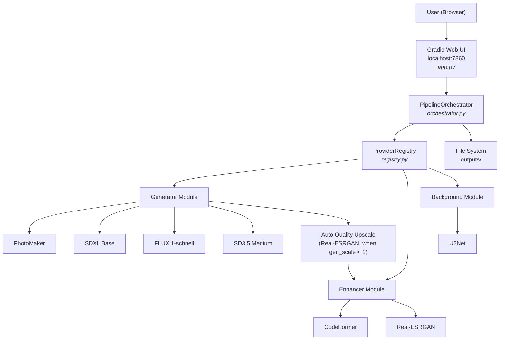
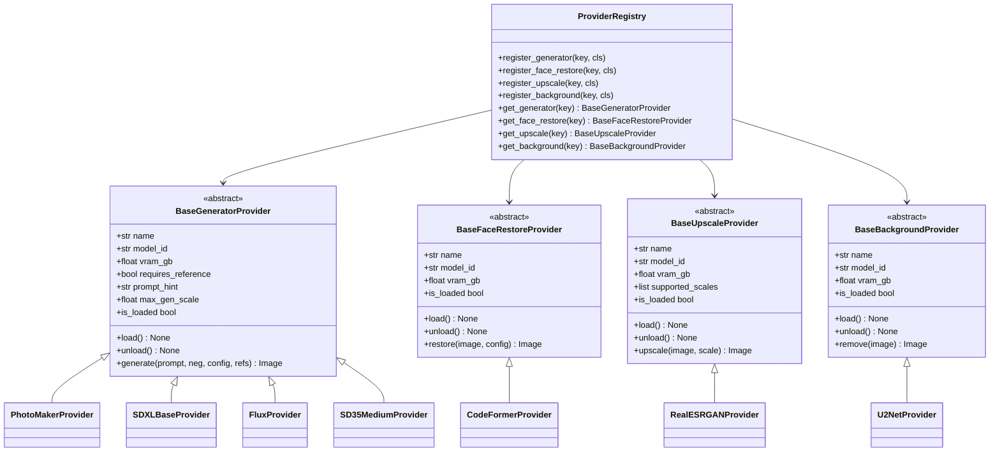
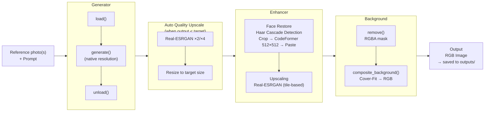
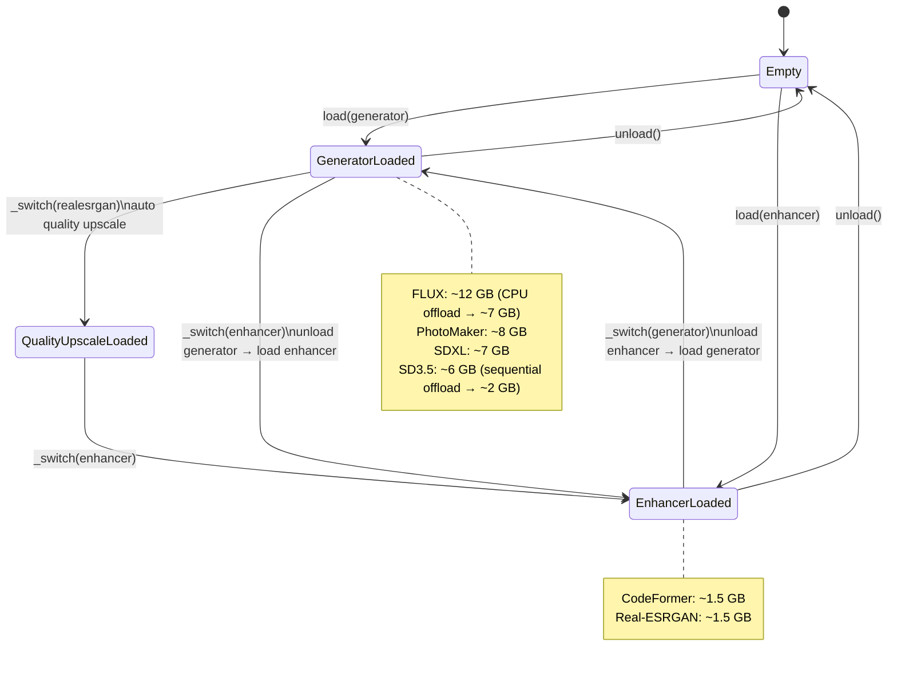

# ARCHITECTURE.md — Technical Architecture

## Table of Contents

- [System Overview](#system-overview)
- [The Provider Pattern](#the-provider-pattern)
- [Data Flow Through the Pipeline](#data-flow-through-the-pipeline)
- [VRAM Scheduling](#vram-scheduling)
- [Hardware & Backend](#hardware--backend)
- [Available Providers](#available-providers)
- [VRAM Management](#vram-management)
- [Prompt Compression](#prompt-compression)
- [Model Sources & Setup](#model-sources--setup)
- [Gradio UI Structure](#gradio-ui-structure)
- [Dependencies](#dependencies)
- [Known Limitations](#known-limitations)

---

## System Overview



---

## The Provider Pattern

Each module defines an abstract base class. Concrete models implement this as providers. The registry is the single place that knows which providers exist. The orchestrator and UI communicate exclusively through the abstraction.



**Adding a new provider — two steps, nothing else:**
1. Create a file in `providers/<module>/`, fully implement the base class
2. Register it in `providers/__init__.py`

**Unimplemented providers:** Create file + `raise NotImplementedError`, **do not** register in the registry.

**Provider interface — required fields for generator providers:**

| Field | Type | Purpose |
|---|---|---|
| `name` | `str` | Display name in Gradio dropdown |
| `model_id` | `str` | HuggingFace ID or local path |
| `vram_gb` | `float` | Estimated VRAM requirement (for scheduling) |
| `max_gen_scale` | `float` | VRAM-safe maximum for gen_scale (0.0–1.0). Default: 1.0. Transformer models (SD3.5, FLUX) set lower values because DirectML materializes the full attention matrix and OOM occurs at high resolutions. |
| `is_loaded` | `bool` (property) | VRAM status indicator in the UI |
| `load()` | method | Load model into VRAM — lazy, never in `__init__` |
| `unload()` | method | Delete reference + `gc.collect()` |

---

## Data Flow Through the Pipeline



Each step (except Auto Quality Upscale) is optional. The orchestrator skips disabled modules and coordinates VRAM scheduling between steps.

**Auto Quality Upscale** kicks in when the generator produces at a reduced resolution (`max_gen_scale < 1.0`). Real-ESRGAN is automatically used to reach the target resolution — instead of LANCZOS interpolation. If Real-ESRGAN is not available, the orchestrator falls back to LANCZOS.

---

## VRAM Scheduling



**Scheduling rule:** Providers with `vram_gb > 3.0` are considered "heavy" (`_HEAVY_THRESHOLD_GB` in `orchestrator.py`). The orchestrator ensures that no more than one heavy provider is loaded at the same time. Lightweight providers (CodeFormer, Real-ESRGAN) may co-exist if the estimated total VRAM fits. `U2Net` (CPU, 0 GB) is exempt.

**DirectML note:** There is no equivalent to `torch.cuda.empty_cache()`. VRAM is freed by deleting the reference + double `gc.collect()` + 0.5 s pause. The first inference of a new provider is slower (DirectML shader compilation) — this is normal behavior.

---

## Hardware & Backend

| Component | Value |
|---|---|
| GPU | AMD Radeon RX 9070 XT |
| VRAM | 16 GB |
| GPU Architecture | RDNA 4 (gfx1201) |
| RAM | 32 GB |
| GPU Backend PyTorch | `torch-directml` 0.2.x |
| GPU Backend ONNX | `onnxruntime-directml` 1.24.x |
| CPU Backend | Fallback for `rembg`, Pillow ops |
| OS | Windows 10/11 |
| Python | 3.12 |

**Why not ROCm?**
ROCm for Windows is a public preview (as of 2026). RDNA 4 (gfx1201) is experimentally supported, but `torch-directml` is the more stable path. DirectML is the Microsoft-maintained GPU standard for Windows + AMD and is actively developed.

**Why two backends?**
`diffusers` models (SDXL, FLUX, PhotoMaker, SD3.5) require PyTorch — on AMD Windows the only option is `torch-directml`. CodeFormer and Real-ESRGAN are provided as ONNX models; there `onnxruntime-directml` is more direct, more stable, and easier to deploy than a PyTorch port.

**DirectML and Transformer Attention:**
Unlike CUDA (Flash Attention, Memory-Efficient Attention), DirectML materializes the full attention matrix in `F.scaled_dot_product_attention`. For SD3.5 and FLUX at 1024×1024, this amounts to several GB for a single tensor. Therefore these providers limit their `max_gen_scale`:

| Provider | max_gen_scale | Reason |
|---|---|---|
| PhotoMaker | 1.0 | UNet architecture, linear scaling |
| SDXL Base | 1.0 | UNet architecture, linear scaling |
| SD3.5 Medium | 0.75 | DiT transformer, quadratic attention scaling |
| FLUX.1-schnell | 0.85 | DiT transformer + 12 GB model weights |

---

## Available Providers

### Generator

| Key | Class | Base Model | VRAM | max_gen_scale | Reference Photo | Notes |
|---|---|---|---|---|---|---|
| `photomaker` | `PhotoMakerProvider` | RealVisXL V5.0 + PhotoMaker Adapter | ~8 GB | 1.0 | yes (1–4) | Trigger token `img` required in prompt |
| `sdxl_base` | `SDXLBaseProvider` | stabilityai/sdxl-base-1.0 | ~7 GB | 1.0 | no | Standard text-to-image |
| `sd35_medium` | `SD35MediumProvider` | stabilityai/sd-3.5-medium | ~6 GB | 0.75 | no | T5-XXL disabled (saves 9 GB); sequential CPU offload; FlowMatching scheduler |
| `flux_schnell` | `FluxProvider` | black-forest-labs/FLUX.1-schnell | ~12 GB | 0.85 | no | No CFG; bf16→fp16 conversion on load (DirectML fix); T5-XXL disabled (Windows crash); max 77 tokens (CLIP); ~23 GB download |

### Face Restore

| Key | Class | Backend | VRAM | Notes | Status |
|---|---|---|---|---|---|
| `codeformer` | `CodeFormerProvider` | ONNX DirectML | ~1.5 GB | Haar Cascade face detection, crop+restore+paste with Gaussian feathering | implemented |
| `gfpgan` | `GFPGANProvider` | ONNX DirectML | ~1.0 GB | — | Stub |

### Upscaling

| Key | Class | Backend | VRAM | Scales | Notes | Status |
|---|---|---|---|---|---|---|
| `realesrgan` | `RealESRGANProvider` | ONNX DirectML | ~1.5 GB | ×2, ×4 | Tile-based inference (256×256 tiles, 32 px overlap, linear blend masks) | implemented |
| `swinir` | `SwinIRProvider` | ONNX DirectML | ~1.0 GB | ×4 | — | Stub |

### Background

| Key | Class | Backend | VRAM | Status |
|---|---|---|---|---|
| `u2net` | `U2NetProvider` | ONNX CPU | 0 GB | implemented |
| `birefnet` | `BiRefNetProvider` | ONNX DirectML | ~1.0 GB | Stub |
| `sam` | `SAMProvider` | torch-directml | ~2.5 GB | Stub |

---

## VRAM Management

**Capacity Planning:**

| Scenario | VRAM Requirement | Feasible |
|---|---|---|
| SD3.5 alone (sequential offload) | ~2 GB peak | ✓ |
| SDXL alone | ~7 GB | ✓ |
| PhotoMaker alone | ~8 GB | ✓ |
| FLUX alone (CPU offload) | ~7 GB | ✓ |
| FLUX alone (no offload) | ~12 GB | ✓ (tight) |
| CodeFormer + Real-ESRGAN simultaneously | ~3 GB | ✓ |
| FLUX + CodeFormer simultaneously | ~13.5 GB | ✗ — not allowed |
| Auto Quality Upscale (ESRGAN) | ~1.5 GB | ✓ (generator already unloaded) |

**`max_gen_scale` and Auto Quality Upscale:**

When a generator produces at a reduced resolution (gen_scale < 1.0), `generate()` returns the native smaller image. The orchestrator detects the size difference to the target and automatically inserts a Real-ESRGAN step:

```
generate() → 768×768 (SD3.5, max_gen_scale=0.75)
  ↓ Generator unloaded
_quality_upscale() → Real-ESRGAN ×2 → 1536×1536 → resize to 1024×1024
  ↓ Real-ESRGAN unloaded
restore() → CodeFormer on 1024×1024
  ↓
upscale() → Real-ESRGAN ×4 → 4096×4096  (optional, user-controlled)
```

This is significantly better in quality than LANCZOS interpolation, as Real-ESRGAN adds real detail. The automatic step runs within the normal VRAM scheduling — no manual intervention needed.

---

## Prompt Compression

All generator providers have a `max_prompt_tokens` limit (77 for CLIP-based encoders). Prompts exceeding this limit are automatically compressed before inference.

**Process:**

```
Prompt (any length)
  ↓ PromptCompressor.compress(prompt, token_limit=max_prompt_tokens)
  ↓ CLIP tokenizer counts tokens
  ├── ≤ limit → unchanged
  └── > limit → flan-t5-small compresses
                  ↓ still > limit or flan-t5 not available
                  └── Greedy fallback: greedily fill comma segments
  ↓
Compressed prompt → Generator
```

**`PromptCompressor` (`pipeline/utils/prompt_compressor.py`):**

- Singleton `compressor` — lazy-loaded, stays in RAM after first call
- `count_tokens(text)` — exact counting via CLIP tokenizer (uses locally available tokenizer directories from already downloaded models, no extra download)
- `compress(prompt, token_limit)` — returns `(compressed_prompt, was_compressed)`
- `unload()` — frees flan-t5 weights (CLIP tokenizer remains)

**Integration:**

| Location | Behavior |
|---|---|
| `on_generate` (`app.py`) | Compresses before direct generator call; updates prompt textbox with compressed version; shows `gr.Info()` with before/after token count |
| `orchestrator.run_full_pipeline` | Compresses before `gen.generate()`; stores compressed prompt in `result["compressed_prompt"]` |

**flan-T5-small:**

- Model: `google/flan-t5-small` (~300 MB)
- Instruction: *"Compress this image generation prompt to at most 12 words. Keep: subject, art style, key visual attributes. …"*
- Backend: CPU (no VRAM conflict with generator)
- Download: `python scripts/download_models.py --models flan_t5_small`
  or automatically on the first `compress()` call
- Local path: `models/utils/flan-t5-small/`

**Greedy fallback** (no model needed):
Splits the prompt at commas, greedily adds segments from the beginning until the token budget is exhausted. First segments (subject, main description) have the highest priority.

---

## Model Sources & Setup

### PhotoMaker

- **Base:** `huggingface.co/SG161222/RealVisXL_V5.0` (~6 GB, fp16)
- **Adapter:** `huggingface.co/TencentARC/PhotoMaker` — `photomaker-v1.bin` (~934 MB)
- **Pipeline code:** `pipeline/community/photomaker_src/` (local copy, no HF request at runtime)
- **Download:** `python scripts/download_models.py --models photomaker photomaker_adapter photomaker_pipeline`
- **Local path:** `models/generator/realvisxl_v5/` + `models/generator/photomaker-v1.bin`

### SDXL Base

- **Source:** `huggingface.co/stabilityai/stable-diffusion-xl-base-1.0` (~5 GB, fp16)
- **Download:** `python scripts/download_models.py --models sdxl`
- **Local path:** `models/generator/sdxl_base/`
- **VAE fix:** `tile_latent_min_size=128` (prevents tiling at 1024×1024, since `128 > 128 = False`), `force_upcast=True` (fp32 decode prevents banding artifacts)

### SD3.5 Medium

- **Source:** `huggingface.co/stabilityai/stable-diffusion-3.5-medium` (~5 GB, fp16)
- **Download:** `python scripts/download_models.py --models sd35_medium`
- **Local path:** `models/generator/sd35_medium/`
- **T5-XXL disabled:** `text_encoder_3=None, tokenizer_3=None` — saves ~9 GB VRAM, CLIP-L + CLIP-G are sufficient for good prompt following
- **Sequential CPU offload:** `enable_sequential_cpu_offload()` instead of `enable_model_cpu_offload()` — moves individual transformer blocks, peak VRAM ~2 GB instead of ~6 GB
- **max_gen_scale=0.75:** Generation at 768×768 for 1024×1024 target; auto quality upscale with Real-ESRGAN

### FLUX.1-schnell

- **Source:** `huggingface.co/black-forest-labs/FLUX.1-schnell` (~23 GB)
- **Download:** `python scripts/download_models.py --models flux`
- **Local path:** `models/generator/flux_schnell/`
- **Prerequisite:** HF account + accept license + `HF_READ_TOKEN` in `.env`
- **DirectML fix:** FLUX weights are bfloat16 — DirectML does not support bfloat16. Solution: load pipeline directly as `torch_dtype=float16` (diffusers casts bf16→fp16 automatically). Additionally, safetensors mmap is disabled via `_no_mmap_safetensors()`, as Windows crashes with Access Violation (`0xC0000005`) on large files (>2 GB).
- **T5-XXL disabled:** `text_encoder_2=None, tokenizer_2=None` — safetensors crashes on Windows (`0xC0000005`) when opening the T5 shards (~3.7 GB per file, 3 shards). FLUX works with CLIP alone; prompt limit 77 tokens. The `PromptCompressor` automatically compresses longer prompts.
- **VAE tiling:** enabled as with SDXL (FLUX VAE has large intermediate tensors during decode)
- **max_gen_scale=0.85:** ~896×896 instead of 1024×1024 as generation resolution

### CodeFormer (ONNX)

CodeFormer is not distributed as ONNX and must be exported once:

```bash
git clone https://github.com/sczhou/CodeFormer && cd CodeFormer
py -3.12 -m venv .venv-cf && .venv-cf\Scripts\activate
pip install -r requirements.txt
py basicsr/scripts/download_pretrained_models.py CodeFormer

py -c "
import torch, sys; sys.path.insert(0, '.')
from basicsr.archs.codeformer_arch import CodeFormer
net = CodeFormer(num_in_ch=3, num_out_ch=3, num_feat=512,
                 num_heads=8, num_layers=9,
                 connect_list=['32','64','128','256'])
ckpt = torch.load('weights/CodeFormer/codeformer.pth', map_location='cpu')
net.load_state_dict(ckpt['params_ema']); net.eval()
torch.onnx.export(net, (torch.zeros(1,3,512,512), torch.tensor([0.7])),
                  'codeformer.onnx', input_names=['input','w'],
                  output_names=['output'], opset_version=17)
"
copy codeformer.onnx ..\portraitforge\models\enhancer\codeformer.onnx
```

- **Input:** `float32`, shape `[1, 3, 512, 512]`, values in `[-1, 1]`
- **Fidelity input `w`:** `0.0` = maximum restoration · `1.0` = maximum identity fidelity
- **Face detection:** OpenCV Haar Cascade (`haarcascade_frontalface_alt2.xml`, ships with opencv-python). Each detected face is cropped with 1.7× padding, processed through CodeFormer at 512×512, and blended back with Gaussian feathering (radius 25). Falls back to the full image when no faces are detected.

### Real-ESRGAN (ONNX)

- **Source:** `huggingface.co/xinntao/Real-ESRGAN` (GitHub Releases — PyTorch `.pth`), no ready-made ONNX available
- **Export:** `python scripts/export_realesrgan_onnx.py` — downloads `RealESRGAN_x4plus.pth` (~64 MB) and exports to `models/enhancer/realesrgan.onnx`
- **Local path:** `models/enhancer/realesrgan.onnx`
- **Input:** `float32`, shape `[1, 3, H, W]`, values in `[0, 1]`
- **Output:** `[1, 3, H×4, W×4]` (model is always ×4; ×2 is emulated via post-resize)
- **Tile-based inference:** Input is split into 256×256 tiles. The blend masks are computed per tile from the **actual** overlap values to neighboring tiles — not from a fixed `overlap` parameter. This guarantees `weight_accum = 1.0` at every pixel, even when the last tile is closer to its predecessor than the normal stride due to forced edge alignment.

### U2Net

- Automatically downloaded on first start via `rembg` (~170 MB → `~/.u2net/`)
- No manual step required

---

## Gradio UI Structure

```
app.py
├── Hardware Banner      Live CPU/RAM/GPU/VRAM display (refreshed every 3 s)
│
├── Tab: Generator
│   ├── Dropdown         Provider selection (registry.list_generators())
│   ├── Gallery          Reference photo upload (max=4, only visible when requires_reference)
│   ├── Textbox          Prompt + Negative Prompt
│   ├── HTML             Provider guidelines (prompt_template, token_limit, negative_prompt_hint)
│   ├── HTML             Token counter (green / orange / red)
│   ├── Dropdown         Resolution (5 presets, all 64px-aligned for SDXL)
│   ├── Dropdown         Scheduler (euler, dpm++2m, dpm++2m_karras, euler_a, ddim)
│   ├── Slider           Steps (10–50) · Guidance Scale (3–10)
│   ├── Slider           Style Strength (0.3–0.9, PhotoMaker only)
│   ├── Number + Button  Seed + Randomize
│   ├── Button           Load / Unload model
│   ├── HTML             VRAM status
│   └── Image            Output (auto-save to outputs/)
│
├── Tab: Enhancer
│   ├── Image            Upload
│   ├── Dropdown         Face Restore Provider · Upscale Provider
│   ├── Slider           Fidelity (0–1)
│   ├── CheckboxGroup    [Face Restore, Upscaling]
│   └── Gallery          Before / After (auto-save to outputs/)
│
├── Tab: Background
│   ├── Image            Upload
│   ├── Dropdown         Background Provider · Background image (from assets/backgrounds/)
│   ├── Image            Custom background upload (optional)
│   └── Image            Output (auto-save to outputs/)
│
└── Tab: Full Pipeline
    ├── Gallery          Reference photos
    ├── Textbox          Prompt · Negative Prompt
    ├── Dropdown         Generator · Face Restore · Upscale · Background (each with checkbox)
    ├── Dropdown         Background image
    ├── Slider           Steps · Guidance · Seed
    ├── Button           Start pipeline
    ├── Progress         Progress indicator
    └── Gallery          Results + intermediate steps (auto-save to outputs/)
```

**Background compositing:** `composite_background()` scales the background via cover-fit (scale + center-crop, no distortion) before applying alpha compositing.

---

## Dependencies

| Package | Version | Purpose |
|---|---|---|
| `torch` | 2.4.1 | PyTorch — pinned to torch-directml |
| `torch-directml` | 0.2.5.dev240914 | AMD GPU backend for PyTorch |
| `torchvision` | 0.19.1 | Image transformations |
| `diffusers` | 0.36.0 | Diffusion model pipelines (SDXL, FLUX, PhotoMaker, SD3.5) |
| `transformers` | 5.4.0 | Text encoders (CLIP, T5) |
| `accelerate` | 1.13.0 | CPU offload hooks (model + sequential) |
| `safetensors` | 0.7.0 | Safe model format |
| `huggingface-hub` | 1.8.0 | Model download |
| `hf_transfer` | 0.1.8 | Rust-based downloader (3–5× faster) |
| `onnxruntime-directml` | 1.24.4 | ONNX inference on AMD GPU |
| `onnx` | 1.20.1 | ONNX model format |
| `Pillow` | 12.1.1 | Image processing |
| `opencv-python` | 4.13.0.92 | Haar Cascade face detection (CodeFormer) |
| `rembg` | 2.0.74 | U2Net wrapper for background removal |
| `numpy` | 2.4.3 | Tensor operations |
| `gradio` | 6.5.1 | Web UI |
| `python-dotenv` | 1.1.0 | Load `.env` file (HF_READ_TOKEN) |
| `tqdm` | 4.67.3 | Progress bars |
| `sentencepiece` | (transitive via transformers) | flan-T5 tokenizer (PromptCompressor) |
| `pytest` / `pytest-mock` | latest | Tests |

---

## Known Limitations

| Problem | Cause | Behavior / Workaround |
|---|---|---|
| `torch-directml` max torch 2.4.x | DirectML backend not yet ported to 2.5+ | Versions pinned in `requirements.txt` |
| No `torch.cuda.empty_cache()` | DirectML has no CUDA equivalent | `del model_ref` + double `gc.collect()` + 0.5 s pause |
| First inference slow | DirectML shader compilation on first run | Normal — significantly faster from 2nd call onward |
| FLUX tight on 16 GB | ~12 GB weights; with CPU offload ~7 GB | CPU offload active by default |
| SD3.5 only at 75% resolution | DirectML materializes attention matrix (no Flash Attention) | Auto quality upscale with Real-ESRGAN to target resolution |
| RDNA 4 ROCm experimental | gfx1201 support incomplete (as of 2026) | DirectML remains the more stable choice |
| U2Net requires internet (once) | `rembg` downloads weights on first call | ~170 MB, fully offline afterward |
| Haar Cascade face detection | Frontal faces; poor detection on side profiles or extreme lighting | Falls back to full image; sufficient for application photos (frontal, well-lit) |
| FLUX T5-XXL not loadable | safetensors crashes on Windows (`0xC0000005`) when mmapping ~3.7 GB shards — Rust bug in native loader | T5 permanently disabled (`text_encoder_2=None`); CLIP encoder + `PromptCompressor` as substitute |
| flan-T5 prompt quality | flan-t5-small is a small model; compression of very long or domain-specific prompts may lose important details | Review compressed prompt in the UI before running and adjust manually if needed; greedy fallback as safety net |

---

## T5 Encoder — Quality Trade-off and Roadmap

### Current Status

Both FLUX and SD3.5 support the T5-XXL encoder for extended prompt processing. T5 is currently **disabled** in both providers:

| Provider | Encoder | Token Limit without T5 | Token Limit with T5 | Reason for Disabling |
|---|---|---|---|---|
| FLUX.1-schnell | T5-XXL (text_encoder_2) | 77 (CLIP) | 512 | Windows safetensors mmap crash (`0xC0000005`) on ~3.7 GB shards |
| SD3.5 Medium | T5-XXL (text_encoder_3) | 77 (CLIP-L + CLIP-G) | 256 | ~9 GB VRAM — not feasible on 16 GB |

### Quality Impact

Without T5, prompt processing is limited to **77 CLIP tokens**. This is sufficient for simple portrait descriptions, but leads to the following issues with complex scenes:

- **Truncation:** Prompts > 77 tokens are silently clipped. The `PromptCompressor` mitigates the problem, but any compression is lossy.
- **Reduced prompt following:** T5 understands semantic relationships significantly better than CLIP. Attribute assignments ("red scarf, blue tie") succeed more reliably with T5.
- **No negation:** CLIP barely understands negated descriptions ("no hat"). T5 could handle this better.

For the primary use case (application photos: "professional portrait, person, clothing, lighting") 77 tokens are sufficient. For more creative prompts, this is a noticeable quality loss.

### Workaround: Pre-convert T5-XXL to fp16 (Future)

The safetensors crash on Windows affects memory-mapping of large individual files (~3.7 GB per shard). A possible workaround:

1. **Offline conversion:** Load T5-XXL shards on a Linux system or via WSL and export as a single fp16 safetensors file (~4.5 GB → ~2.3 GB in fp16).
2. **Shard splitting:** Split the converted file into shards < 2 GB (below the Windows mmap threshold).
3. **Sequential CPU offload for T5:** Load T5 via `enable_sequential_cpu_offload()` — peak VRAM for T5 encoding ~1–2 GB instead of 4.5 GB.
